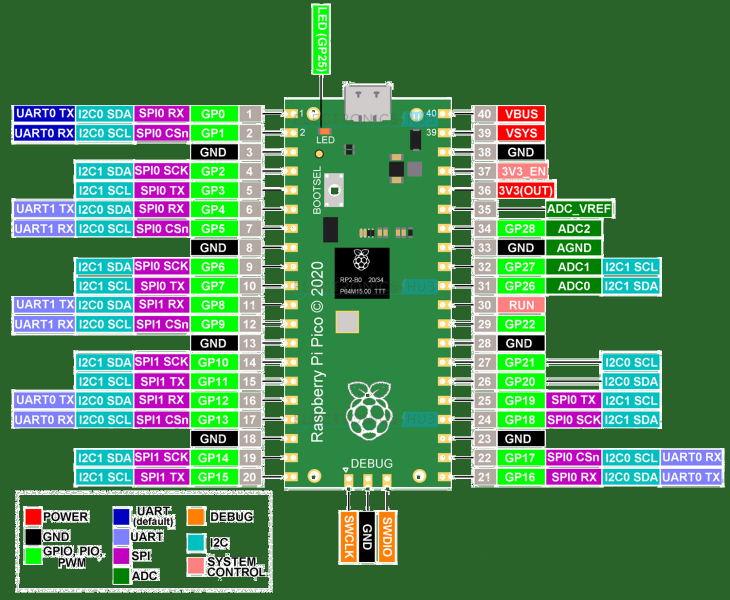

# pico-AD597

# Utworzenie projektu CMAKE
Projekt na początku ma zawierać plik main.c, CMakeList.txt i katalog build. Nazwa main.c jest w CMakeList.txt.

```
$ cd build
$ cmake ..
$ make -j2
```

Amongst other targets, we have now built:
• blink.elf, which is used by the debugger
• blink.uf2, which can be dragged onto the RP2040 USB Mass Storage Device
This binary will blink the on-board LED of the Raspberry Pi Pico which is connected to GPIO25 of RP2040.

Teraz tylko wgrać build.uf2 na dysk pico (Podłączenie ze wciśniętym przyciskiem) - miga zielona dioda USER_LED na płytce.

# Podłączenie terminala do raspberry pico 
Funkcja printf() ma skonfigurowany output na serial over USB zamiast na UART.
Po połączeniu komputera z pico kablem USB sprawdź nazwę urządzenia.
```
$ dmesg | egrep --color 'USB ACM device'

```
Uruchom konsolę zestawiając połączenie szeregowe z raspberry pico:
```
$ sudo minicom -b 115200 -D /dev/ttyACM0
```

# Konfiguracja sprzętowa



# Oprogramowanie czujników temperatury

## Termopara typu k z przetwornikiem AD597


Odnośniki:
