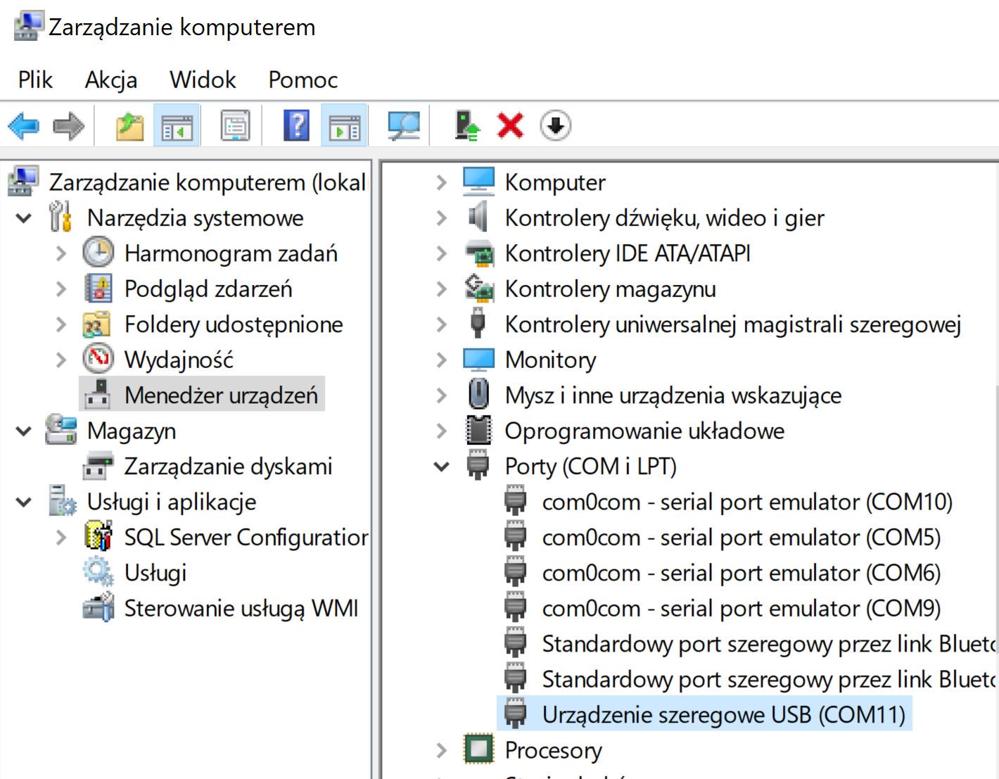
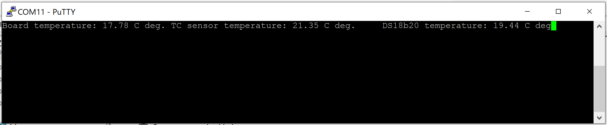

# Projekt pico-AD597

Celem projektu jest kod urządzenia testowego czujników temperatury.
Odczyty temperatury powinny być wyświetlane na konsoli.


# Konfiguracja

Zobacz [Using the Raspberry Pi Pico on Ubuntu](https://www.gibbard.me/using_the_raspberry_pi_pico_on_ubuntu/)

1. Zainstalowanie PICO-SDK i skompilowanie przykładów w folderze ~/Development/pico:
```
$ git clone -b master https://github.com/raspberrypi/pico-sdk.git
$ cd pico-sdk
$ git submodule update --init

# Add SDK path to your environment
$ echo 'export PICO_SDK_PATH=$HOME/Development/pico/pico-sdk' >> ~/.bashrc 

$ cd ..
$ git clone -b master https://github.com/raspberrypi/pico-examples.git

# build blink example
$ cd pico-examples
$ mkdir build
$ cd build
$ cmake ..
$ cd blink
$ make -j $(nproc)
```

# Utworzenie nowego projektu CMAKE
Projekt na początku ma zawierać:
* plik z funkcją __main()_; dla porządku w folderze __src__)
* CMakeList.txt
* katalog build (pusty)

Nazwa pliku z funkcją main() jest podana CMakeList.txt jako __main.c__.
```
$ cd build
$ cmake ..
$ make -j2
```

Make powinien poprawnie zbudować następujące "targety":
* __blink.elf__ - którego używa debugger
* __blink.uf2__ - który można przeciągnąć na urządzenie pamięci masowej USB RP2040

Skopuj __build.uf2__ na dysk virtualny pico (ponowne podłączenie kabelka USB ze wciśniętym przyciskiem na pico).

# Podłączenie terminala do raspberry pico 
Dwie ostatnie linie w pliku __CMakeLists.txt__ definiują działanie funkcji printf(). Ma ona skonfigurowany output na serial over USB zamiast na UART.
## Linux (Ubuntu)
Po połączeniu komputera z pico kablem USB możesz sprawdzić nazwę urządzenia dla portu szeregowego:
```
$ dmesg | egrep --color 'USB ACM device'
[13287.289925] cdc_acm 4-1:1.0: ttyACM0: USB ACM device
```
a nastepnie uruchom konsolę __minicom__ zestawiając połączenie szeregowe z raspberry pico:
```
$ sudo minicom -b 115200 -D /dev/ttyACM0
```

## MS Windows
Po połączeniu komputera z pico kablem USB możesz sprawdzić numer portu szeregowego:



Nastepnie uruchom putty zestawiając połączenie szeregowe z COM11; prędkość dla serial over USB jest bez znaczenia (zostaw 9600).

# Wyświetlenie wyników na konsoli


# Konfiguracja sprzętowa


# Oprogramowanie czujników temperatury
## Wewnętrzny sensor temperatury
Wewnętrzny czujnik temperatury jest sprzętowo ustawiony na ADC4. Zgodnie z dokumentacją odczyty z przetwornika przeliczane są następująco:
```C
    const float conversion_factor = 3.3f / (1 << 12);
    float ADC_Voltage = (float)adc_read() * conversion_factor;
    float temp1 = 27 - (ADC_Voltage - 0.706)/0.001721;
```

## Termopara typu k z przetwornikiem AD597
Przetwornik generuje na wyjściu napięcie (0..VCC) proporcjonalne do temperatury. Dla 100 stopni należy się spodziewać 1V, górny zakres zależy od termopary, ale pzy zasilaniu 3.3V nie przekroczy 330 stopni. 
Do odczytu sygnału analogowego z wyjścia przetwornika AD597 wykorzystano ADC0, czyli GP26 w Rassperry PI pico:
```C
/* File name: AD597.h */
#define TC1_pin 26
```

## Czujniki temperatury I2C - Dallas DS18b20
Do odczytu temperatury z czujników I2C wykorzystano implementację __one wire__ od [Adam Boardman](https://github.com/adamboardman/pico-onewire).

References:
* [Raspberry Pi pico examples](https://raspberrypi.github.io/pico-sdk-doxygen/examples_page.html), [GitHub code](https://github.com/raspberrypi/pico-examples)
* [Raspberry Pi Pico (RP2040) I2C Example with MicroPython and C/C++](https://www.digikey.pl/en/maker/projects/raspberry-pi-pico-rp2040-i2c-example-with-micropython-and-cc/47d0c922b79342779cdbd4b37b7eb7e2)

* [How to Program Raspberry Pi Pico using C/C++ SDK](https://circuitdigest.com/microcontroller-projects/how-to-program-raspberry-pi-pico-using-c)

* [Working with the Raspberry Pi Pico with Windows and C/C++](https://community.element14.com/products/raspberry-pi/b/blog/posts/working-with-the-raspberry-pi-pico-with-windows-and-c-c)
* [Raspberry Pi Pico and RP2040 - C/C++ Part 2: Debugging with VS Code](https://www.digikey.be/en/maker/projects/raspberry-pi-pico-and-rp2040-cc-part-2-debugging-with-vs-code/470abc7efb07432b82c95f6f67f184c0)

Environment related references:
* [Forbot](https://forbot.pl/forum/topic/19701-raspberry-pi-pico-podstawy-dla-zielonych/) podstawowe informacje dla środowiska Rasperry PI
* [Building Code for the Raspberry Pi Pico](https://www.teachmemicro.com/building-code-raspberry-pi-pico/) with Visual Studio 2019

CMake related references:
* [CMAKE commands](https://cmake.org/cmake/help/latest/manual/cmake-commands.7.html)
* [Modern CMake is like inheritance](https://kubasejdak.com/modern-cmake-is-like-inheritance)